# Nanostation 5

Another device I got from a friend ;) 

#### Getting Started

Launch tcpudmp: 

    tcpdump -i <interface> -aaaa -tttt -vvv -s0 

Set your IP: 

      ifconfig <interface> 192.168.1.100 netmask 255.255.255.0

You will now see traffic flooding in tcp screen, browse to 

      https://192.168.1.20
      Default Username: ubnt
      Default Password: ubnt

Below is some screenshots: 

### MainScreen
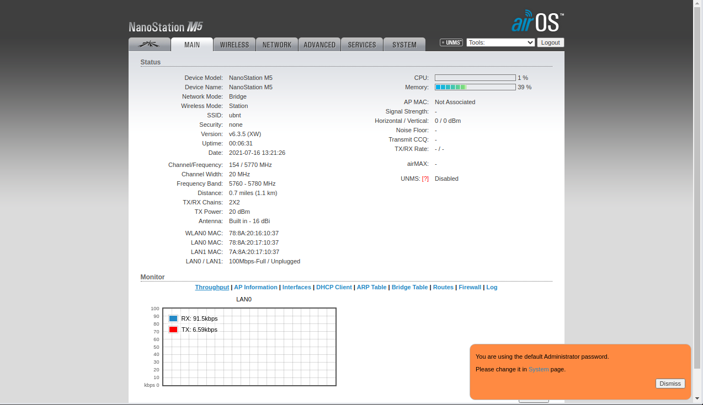

### Wireless
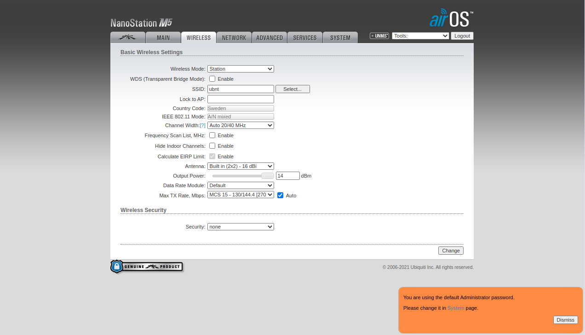

### Wireless Ap-Reapeatr

### Network Bridge
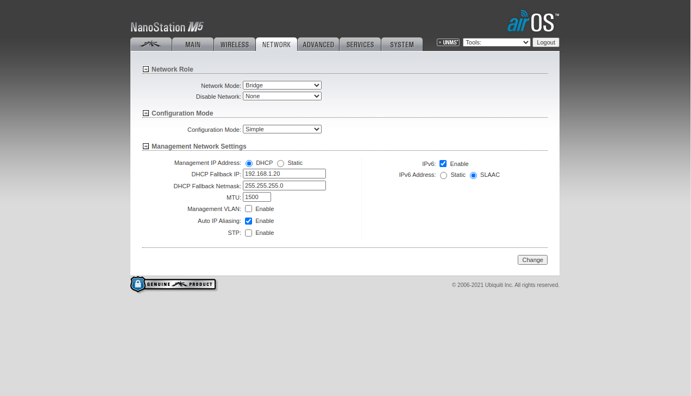

### Network Router
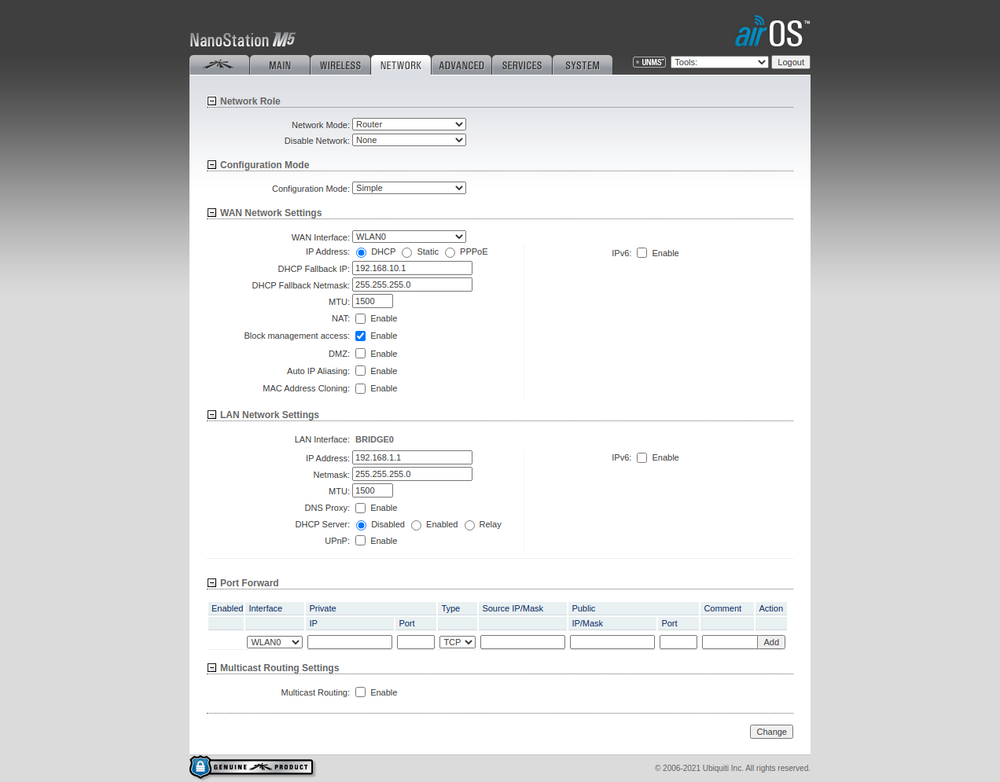

### Network SOHO Router
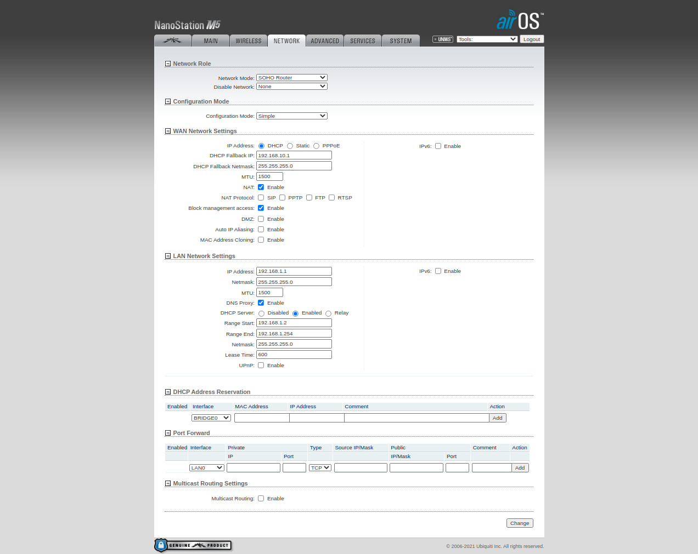

### Advanced
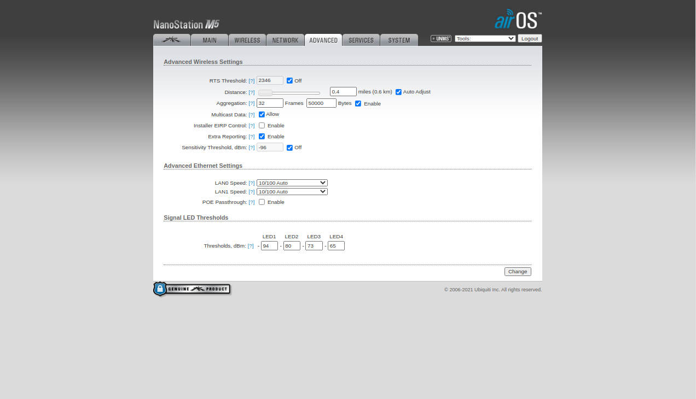 

### Services
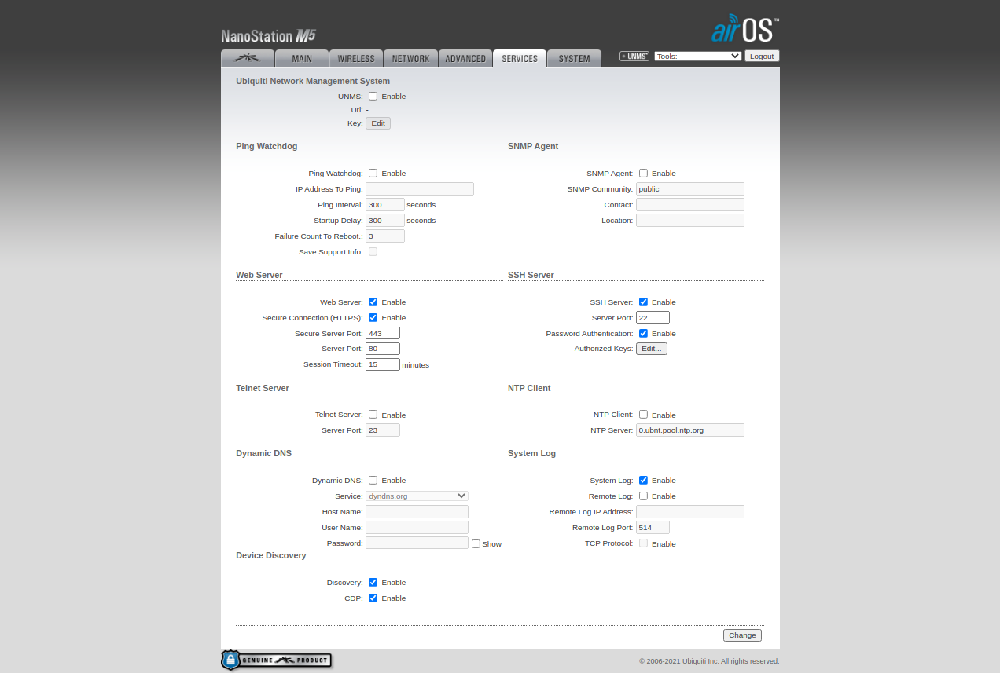

### System
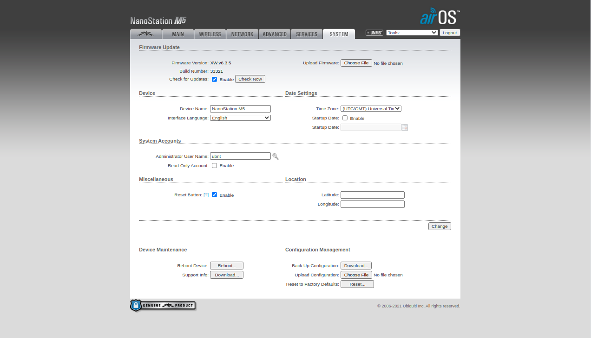

### Align Antenna
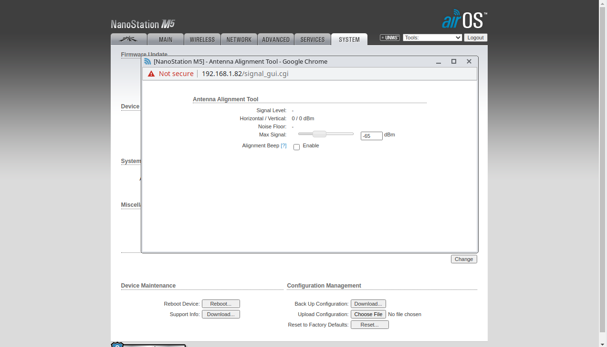

### Site Survey 
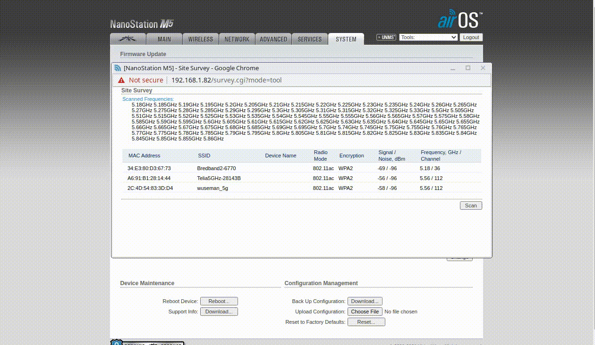

### Discovery
 

### Ping
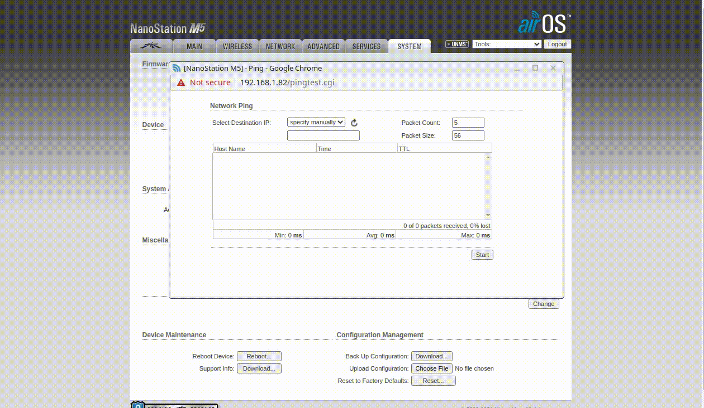

### Airview

# Cloud

Cloud is for those who have 10 or more devices, however, here is some screenshots

### Ubiquiti rocks! They offer free access to their website
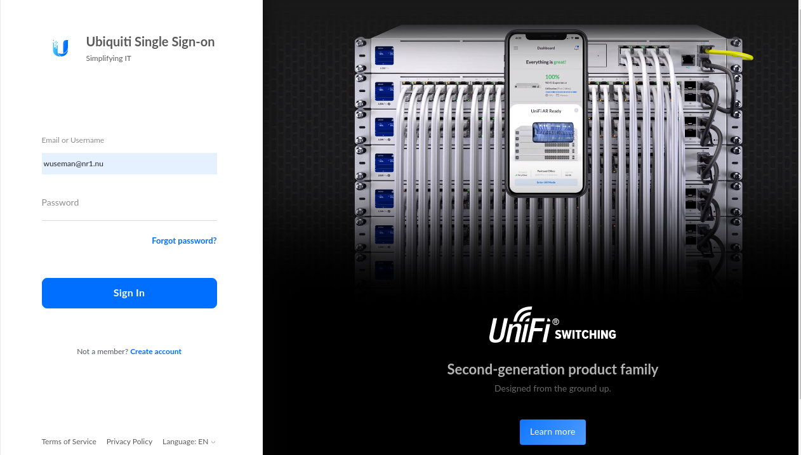

### UISP Dashboad
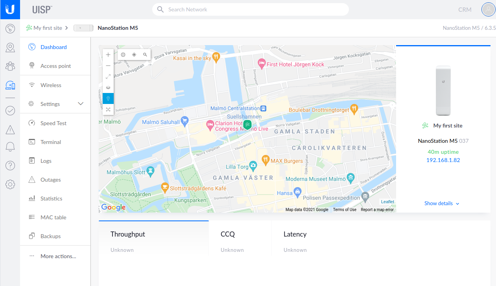

### UISP Dashboard after few minutes running
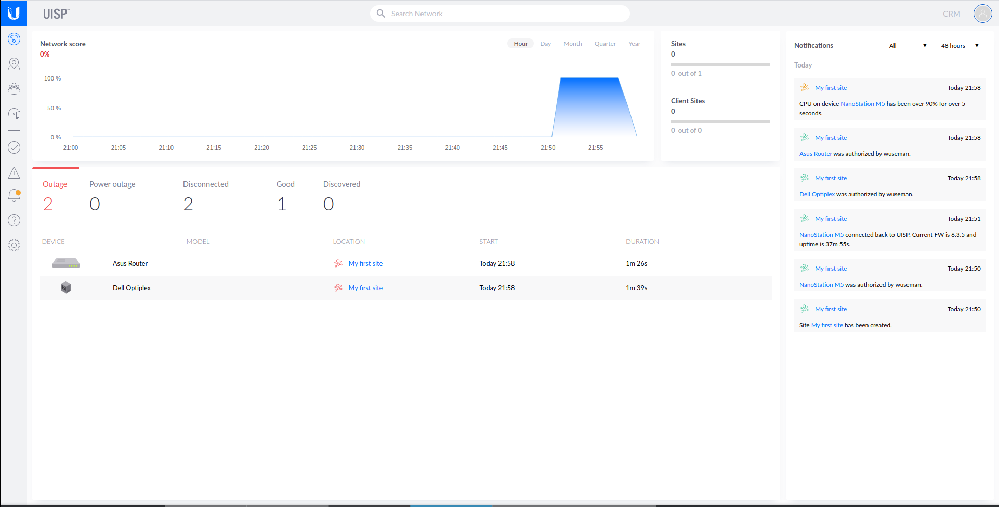

### Cloud shell is included
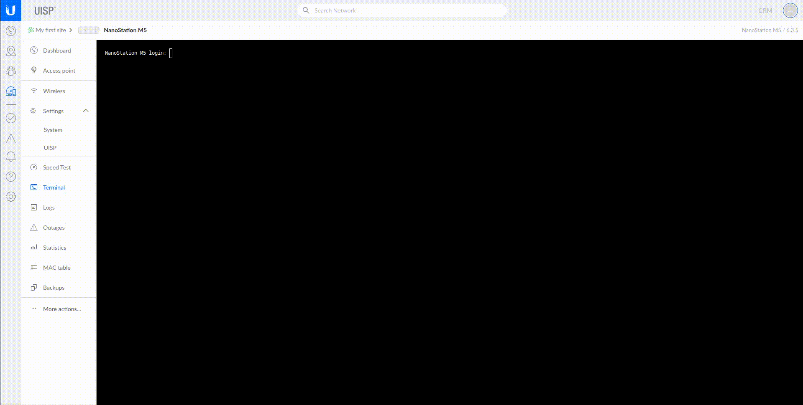

### Stats is also included of course.

#### Application for android
Android App: https://play.google.com/store/apps/details?id=com.ubnt.umobile
